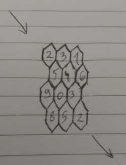

# Bike

One day, while riding his bike, Pesho had to go through the centre of Sofia.
All was well, until he noticed that the ground was made out of hexagon tiles and was not necessarily even:



The picture shows an example of **4** rows and **3** columns of hexagons.
The numbers represent the height of each tile. The height of the ground outside the hexagons is always **0**.

Pesho has to enter the upper-left tile pass and exit from the bottom-right one.
When he passes through two different heights his bike receives **damage** equal to their difference.
Help Pesho minimize the **damage** his bike receives.

## Input
- Input is read from the console
  - On the first line an integer number **R** is given
    - the number of rows
  - On the second line an integer number **C** is given
    - the number of columns
  - On each of the next **R** lines **C** numbers will be given
    - the heights of the tiles
	- separated by spaces

## Output
- Output should be printed to the console
  - On single line print the minimal the damage Pesho's bike can receive
    - Output with **two digits** of precision

## Constraints
- 0 < **R**, **C** <= 500
- -100 <= **height of a cell** <= 100
- **Time limit**: **0.5s**
- **Memory limit**: **64 MB**

## Sample tests

### Sample test 1

#### Input
```
4
3
2 3 1
5 4 6
9 0 3
8 5 2
```

#### Output
```
8.00
```

#### Description
```
Pesho enters cell 2  -> receiving 2 damage
then goes to cell 3  -> receiving 1 damage
then goes to cell 4  -> receiving 1 damage
then goes to cell 3  -> receiving 1 damage
then goes to cell 2  -> receiving 1 damage
finally exits cell 2 -> receives 2 damage

total damage -> 8
```

### Sample test 2

#### Input
```
4
4
1 8 9 6
1 4.3 2.7 -3
1 -64 3 3
1 1 1 1
```

#### Output
```
2.00
```
