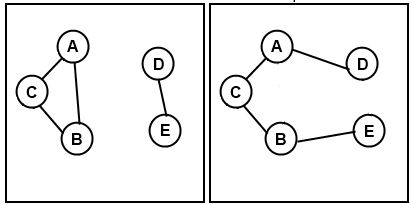

There is a country with **N** cities, some of which are connected with bidirectional roads. Your task is to reconfigure the roads so that it is possible to get from each city to every other city. You must do this using the minimum possible number of transformations, where each transformation consists of the following steps:
1. Choose four different cities A, B, C and D, where roads (A, B) and (C, D) exist, but (A, C), (A, D), (B, C) and (B, D) do not exist.
2. Destroy roads (A, B) and (C, D). 
3. Build two new roads - either (A, C) and (B, D), or (A, D) and (B, C).

The following images show an example of this transformation. From the first situation you can get the second one or the third one:


## Input
- The input data should be read from the console. 
- On the first line you should read **T** – the number of the tests you should solve. 
- Each of the T tests will be in the following format:
	- On the first line of each test case you will be given the number N – the number of the cities in the country. 
	- On the each of the next **N** lines you will be given **N** symbols altogether constructing a two dimensional array **G** where the **j**-th character of the **i**-th line is '**1**' if there is a road between cities **i** and **j**, and '**0**' otherwise.
- The input data will always be valid and in the described format. There is no need to check it explicitly.

## Output

- The output data should be printed on the standard output.
- For each of the test cases print one line containing the minimal number of transformations required to accomplish your task, or print **-1** if it is impossible.

## Constraints

- **T** will be between 3 and 20, inclusive.
- **N** will be between 2 and 50, inclusive.
- For each **i** and **j**, **G[i][j]** will be equal to **G[j][i]** (if city A is connected to city B, then city B is also connected to city A).
- For each **i**, **G[i][i]** will be equal to '0' (no city is connected to itself).

## Sample tests

### Input
```
3
2
01
10
5
01100
10100
11000
00001
00010
6
010000
101000
010100
001000
000001
000010
```

### Output

```
0
1
-1
```

### Explanation
**First test:**
The cities are already connected.

**Second test:**
You need one transformation shown on the pictures below:


**Third test:**
Here it is impossible to connect all the cities using the given transformation, no matter how many times you do it.


