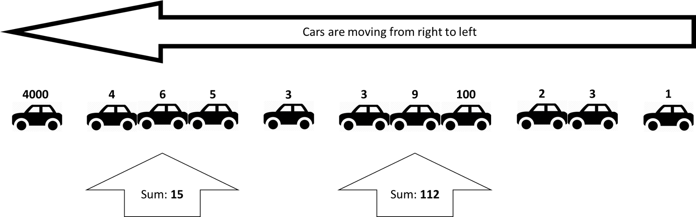

You are given a sequence of the speeds of cars in a single-lane-street.
A car can catch up to the car B, only if B is in-front of A and the
speed of A is greater than the speed of B, and then the speed of A is
lowered to the speed of B. Each gathering of cars is called a group. You
task is to find the sum of the **initial speeds** of the **longest
group** of cars (the group with most cars in it). If more than one group
with equal length exists, then find the biggest sum of the initial
speeds of these groups.

# Additional notes

-   Cars cannot outrun each other
    -   They can only catch up
-   The streen is very very long and no matter the speed
    -   No car with any speed can get out of it till the end of the exam
-   Cars with equal speeds do not catch up to each other
    -   They do not form a group

# Example:

-   There are two groups with biggest length
    -   `4 + 6 + 5 = 15`
    -   `3 + 9 + 100 = 112`
-   The answer is `112`



# Input

All input data is read from the standard input (the console)

-   On the first line will be the number `C`
    -   The number of cars
-   On the next `C` lines there will a single integer number `S`
    -   The speed of each car

# Output

The output data is printed on the standard output (the console)

-   On the single line on the output print the **sum of the the initial
    speeds of longest group** (the group with most cars)
    -   If there are groups with equal length, print the biggest sum

# Constraints

-   `C` will always be between `1` and `1000`
-   Each `S` will always be between `1` and `1500`
-   **The input data will always be correct and there is no need to
    check it explicitly**

# Sample Tests

## Input
```
    11
    1500
    4
    6
    5
    3
    3
    9
    100
    2
    3
    1
```

## Output
```
    112
```

## Input
```
    4
    1
    1
    1
    1
```

## Output
```
    1
```

## Input
```
    5
    5
    4
    3
    2
    1
```

## Output
```
    5
```

## Input
```
    5
    1
    2
    3
    4
    5
```

## Output
```
    15
```   
